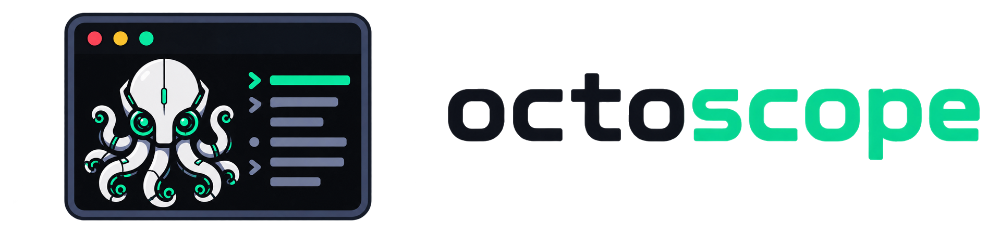

# octoscope

<p align="center"></p>

[日本語](README.ja.md)

A terminal dashboard for GitHub pull requests and issues. Browse a diff,
comment on a line, and submit a review without leaving the terminal.

octoscope = **Octo**cat + **-scope**: a telescope for looking over your GitHub work.

## Requirements

One of:

- [GitHub CLI](https://cli.github.com/) (`gh`), authenticated via `gh auth login`
- A personal access token in `GH_TOKEN` or `GITHUB_TOKEN`

See [Authentication](#authentication).

## Install

### mise

[mise](https://mise.jdx.dev/) installs the released binary from GitHub Releases:

    mise use -g github:kukv/octoscope@latest

Or pin it per project in `mise.toml`:

    [tools]
    "github:kukv/octoscope" = "latest"

### Manual download

Grab the archive for your platform from the
[releases page](https://github.com/kukv/octoscope/releases), extract it, and put
`octoscope` somewhere on your `PATH`:

    tar xzf octoscope_<version>_linux_amd64.tar.gz
    install -m 0755 octoscope ~/.local/bin/

On Windows, unzip the archive and place `octoscope.exe` in a directory on `PATH`.

`checksums.txt` is published alongside the archives:

    sha256sum -c checksums.txt --ignore-missing

### go install

    go install github.com/kukv/octoscope/cmd/octoscope@latest

`--version` prints `dev` with this method; the version string is stamped in at
release build time.

### Build from source

    git clone https://github.com/kukv/octoscope.git
    cd octoscope
    go build -o octoscope ./cmd/octoscope

## Usage

Run it inside a git repository:

    octoscope

Or point it at any repository:

    octoscope --repo kukv/octoscope

### Flags

| Flag | Description |
|---|---|
| `--repo owner/name` | Target repository, and the tab octoscope opens on. Defaults to the repository of the current directory, and to the Work tab. |
| `--lang en\|ja` | Display language. Defaults to the settings file, then the operating system locale. |
| `--icons unicode\|nerd\|ascii` | Glyph set. Defaults to `unicode`; `OCTOSCOPE_ICONS` or the settings file sets it permanently. |
| `--backend auto\|gh\|api` | How to reach GitHub. Defaults to `auto`; `OCTOSCOPE_BACKEND` or the settings file sets it permanently. See [Authentication](#authentication). |
| `--version` | Print the version and exit. |

### Settings file

octoscope reads `octoscope/config.yaml` under `$XDG_CONFIG_HOME`, or
`~/.config` when that is unset — macOS included, so one dotfiles layout
reaches it everywhere. On Windows it is under `%AppData%`. The file is
optional; a missing or empty one just means every setting is at its default.

Before v0.7.0 macOS looked under `~/Library/Application Support`. To carry an
existing file over:

```bash
mkdir -p ~/.config/octoscope
mv ~/Library/Application\ Support/octoscope/config.yaml ~/.config/octoscope/
```

| Key | Values |
|---|---|
| `language` | `en` or `ja` |
| `icons` | `unicode`, `nerd`, or `ascii` |
| `backend` | `auto`, `gh`, or `api` |
| `default_tab` | `repos` or `search`, to start on that tab instead of Work. `--repo` outranks it. |
| `saved_queries` | The Search tab's saved queries: a list of `name` / `query` pairs. `s` adds one, `x` in the `ctrl+o` popup removes one. |

```yaml
saved_queries:
  - name: mine
    query: is:open author:@me
  - name: reviews
    query: is:open review-requested:@me
```

Pass `--icons nerd` if you have a [Nerd Font](https://www.nerdfonts.com/)
patched font installed, or `--icons ascii` if the Unicode symbols do not draw.
There is no reliable way to detect a patched font — a terminal reports neither
the font in use nor its coverage — so the default is the set that needs none.

### Authentication

octoscope reaches GitHub in one of two ways:

- **gh**: runs the `gh` command, which uses the account from `gh auth login`.
- **api**: calls the GitHub API over HTTPS with a personal access token read from
  `GH_TOKEN`, or `GITHUB_TOKEN` when that is unset. `gh` is not needed.

Which one is used is chosen by `--backend`, then `OCTOSCOPE_BACKEND`, then
`backend` in the settings file:

| Value | Uses |
|---|---|
| `auto` (default) | `gh` if it is on `PATH`, otherwise a token |
| `gh` | `gh` only |
| `api` | a token only, even when `gh` is installed |

An unrecognized value stops octoscope from starting, with a message saying where
the value came from.

`gh` itself also reads `GH_TOKEN` and `GITHUB_TOKEN` and prefers them over its
stored login, so under `auto` a token takes effect whether or not `gh` is
installed.

The token needs these permissions:

- Classic token: `repo`. Add `read:org` if you want your organizations'
  repositories suggested in the Repos tab.
- Fine-grained token, for each repository you open: Pull requests, Issues,
  Contents and Actions (read and write), and Checks, Commit statuses and
  Metadata (read). Grant only read access if you only want to browse.

The `api` backend talks to github.com only; `GH_HOST` and
`GH_ENTERPRISE_TOKEN` are not read, so GitHub Enterprise Server needs `gh`.

### Keys

| Key | List | Detail | Diff |
|---|---|---|---|
| `j` / `k` | move cursor | scroll | move line |
| `enter` | open detail | — | open a collapsed thread |
| `tab` | switch PRs / Issues | — | — |
| `r` | refresh | refresh | refresh |
| `o` | open in browser | open in browser | — |
| `d` | open diff | open diff | — |
| `s` | open checks | open checks | — |
| `c` | — | comment (`Ctrl+S` send / `Esc` cancel) | comment on this line (`Ctrl+S` send / `Esc` cancel) |
| `v` | — | open the review popup | open the review popup |
| `X` | — | — | discard the pending review (`y` confirm / `n` cancel) |
| `x` | — | close / reopen (`y` confirm / `n` cancel) | — |
| `l` | — | edit labels (`space` toggle / `enter` apply) | — |
| `a` | — | edit assignees (`space` toggle / `enter` apply) | — |
| `[` / `]` | — | — | move file |
| `{` / `}` | — | — | move hunk |
| `h` / `l` | — | — | move pane |
| `esc` | — | back to list | back |
| `q` | quit | back to list | back |

The review popup submits with `Ctrl+S` after picking an event (approve /
request changes / comment).

### Mouse

| Action | Effect |
|---|---|
| Click a tab | Switch to it |
| Click a card or row | Select it |
| Click the selected card or row | Open its detail |
| Wheel | Move the cursor in the column under the pointer; scroll the body in the detail view |

## Localization

octoscope speaks English and Japanese. The language is chosen from `--lang`
first, then the settings file, then the operating system locale, and falls
back to English.
